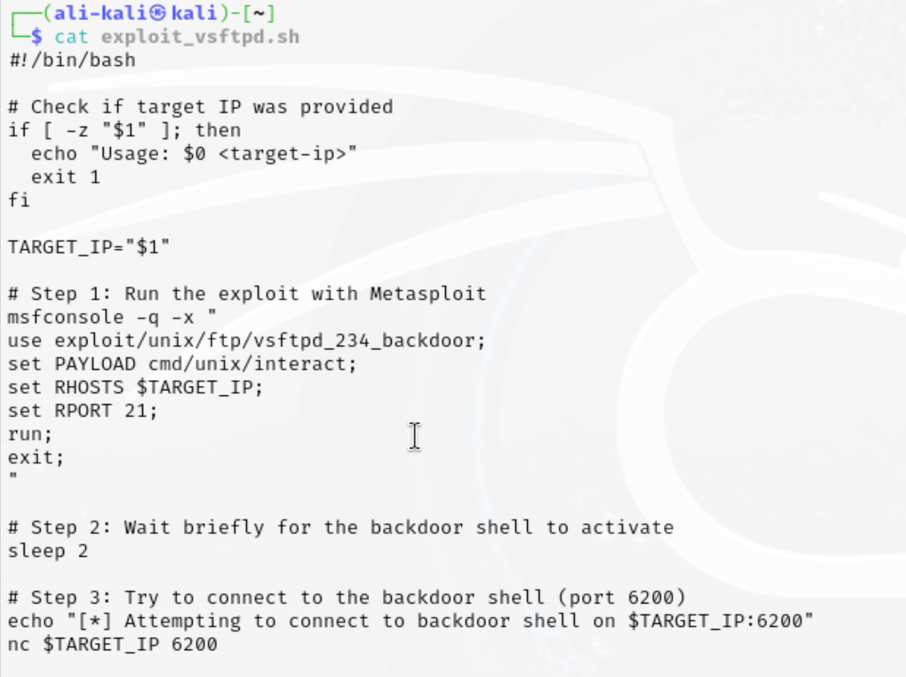
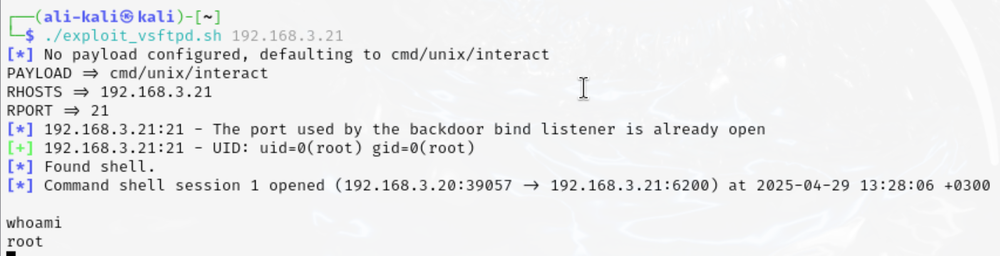

# Task 1.2 documentation

In this task, we created a **custom Bash script** to automate the exploitation of the `vsftpd 2.3.4` vulnerability in the Metasploitable3 environment using Kali Linux.

---

## Step 1: Writing the custom script

We wrote a Bash script named `exploit_vsftpd.sh` that performs the following actions:

- Takes the **target IP** as a parameter.
- Launches **Metasploit** using the `vsftpd_2.3.4` backdoor exploit module.
- Sets the payload to `cmd/unix/interact` to open an interactive shell.
- Configures the target IP and port (21), runs the exploit, then attempts to connect to the shell on port 6200.

Screenshot of the script:



---

## Step 2: Executing the script

We ran the script using the following command:

```bash
./exploit_vsftpd.sh 192.168.3.21
```
