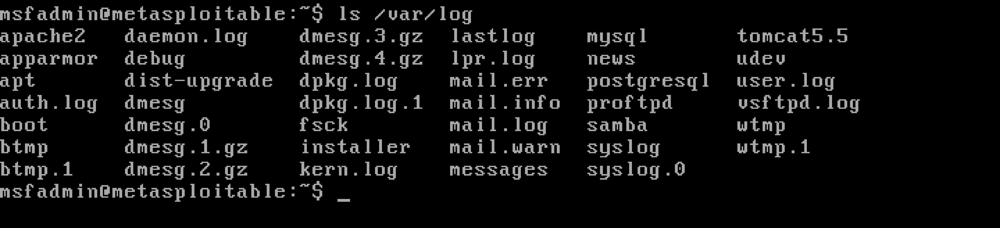

# Phase 1 Documentation

## Task 1.1 

On this task we used the Kali Linux Metasploit framework to compromise a service on the Metasploitable2 victim machine.

---
## Step 1: Identify the attacker (Kali Linux) and the victim (Metasploitable 2) IP addresses
Before attacking, we need to know the IP addresses to ensure that the attack will be directed toward the desired target.
- **IP addresses screenshots**:
  - 
  - 
## step 2: ensuer that kali is connected to the Metasploitable 2 virtual machine
- pinging the other virtual machine:
  - 
## step 3: finding the volners that could be exploited:
- we did it through a command that output the script of the volnerabilities on ports number 21, 22, and 80.
    - 
## step 4: running the mfsconsole command then search for the possible vuners inside vsftpd and finally choose the vulnerability with excelant rank.
- first we run the mfsconsole command then we searched for the vulners command then we used the vulnaribility with the excelant rank.
  - 
## step 5: configure the mfconsole with the metasploitable 2 attributes and run the attack
- setting the right host to be the metasploitable 2 ip, and we set the right port to be 24. then we run the code to start the exploitation
  - 
## step 6: writting commands on Metasploitable 2 to show the attacker ability on interacting with the compromised victim machine
-  on this step we tried some commands on the victim machine:
    1. whoami command which indicate that the attacker have root privliges.
    2. uname -a command which indicate that the attacker can gather the system information.
    3. cat /etc/shadow command which indicate that the attacker can attempt to read files.
   - 

# Task 1.2 documentation

In this task, we created a **custom Bash script** to automate the exploitation of the `vsftpd 2.3.4` vulnerability in the Metasploitable3 environment using Kali Linux.

---

## Step 1: Writing the custom script

We wrote a Bash script named `exploit_vsftpd.sh` that performs the following actions:

- Takes the **target IP** as a parameter.
- Launches **Metasploit** using the `vsftpd_2.3.4` backdoor exploit module.
- Sets the payload to `cmd/unix/interact` to open an interactive shell.
- Configures the target IP and port (21), runs the exploit, then attempts to connect to the shell on port 6200.

Screenshot of the script:


---

## Step 2: Executing the script

We ran the script using the following command:

```bash
./exploit_vsftpd.sh 192.168.3.21
```

# Phase 2 Documentation

In this task, we used Splunk Enterprise installed on the host (Mac) as a SIEM to collect and analyze logs from both the victim (Metasploitable2) and attacker (Kali Linux) machines. The goal is to visualize the attack pattern and assess its impact using real log data.

---

## Step 1: Check logs on the victim machine (Metasploitable 2)
We located and reviewed the FTP log file (`/var/log/vsftpd.log`) after performing the vsftpd 2.3.4 backdoor attack from the Kali Linux machine.
- **Log review screenshot**:
  - 

## Step 2: Send the logs to the host machine (Mac)
Since Metasploitable 2 is a lightweight system without a forwarder, we used a direct transfer method over the local network to send the `vsftpd.log` file to the Mac.
- **Screenshot of file transfer**:
  - 

## Step 3: Import logs into Splunk (host SIEM)

### Victim logs:
We imported the extracted `vsftpd.log` file from the victim machine into Splunk and selected the appropriate settings:
- **Source type:** `ftp`
- **Host name:** Set as the name of the victim machine
- **Screenshot**:
  - 

### Attacker logs:
We collected logs from the Kali machine (e.g., `~/.msf4/logs`, terminal history, or custom logging of the exploit) and imported them into Splunk as well.
- **Screenshot**:
  - 

## Step 4: Visualize the attack patterns using Splunk dashboards

We visualized logs using Splunk search and filtering capabilities to analyze the behavior of both machines during the exploit.

### Attacker log insights:
We visualized connection attempts and exploit triggers from the Kali machine.
- **Screenshots**:
  - 
  - 

### Victim log insights:
The logs from `vsftpd.log` clearly showed multiple connection attempts from the attacker's IP (192.168.3.20).
- **Screenshot**:
  - 

## Step 5: Analyze and compare logs between attacker and victim

Finally, we correlated the timestamps and IP addresses to visualize how the attack from Kali (attacker) impacted Metasploitable2 (victim).
- **Screenshot**:
  - 

---

> - Logs collected from both attacker and victim
> - Imported into Splunk SIEM
> - Visualized clearly using Splunk dashboards
> - Compared and analyzed to understand the attack flow

# Phase 3 documentation

In this phase, we implemented a defensive strategy to mitigate the `vsftpd_2.3.4` backdoor vulnerability on Metasploitable 2. This vulnerability allowed attackers to gain root access via a hidden backdoor on port 6200. Our defense focused on removing the vulnerable binary and blocking the FTP port (21) to completely shut down the exploit path.

---

## Step 1: Delete the vulnerable `vsftpd` binary

We located the `vsftpd` binary using the `which` command and removed it to prevent any further exploitation of the backdoor.

- **Screenshot**:  
  

---

## Step 2: Block port 21 using `iptables`

To prevent any new connections to the FTP service, we blocked incoming traffic on port 21 using the `iptables` firewall.

- **Screenshot**:  
  

---

## Step 3: Validate the defense (before vs after)

We tested the defense by running the original attack script both before and after applying the defensive measures.

### Before defense:

The exploit succeeded, giving the attacker a root shell through the backdoor on port 6200.

- **Screenshot**:  
  

### After defense:

The exploit failed to connect to the FTP service and was unable to spawn a shell.

- **Screenshot**:  
  

---
> - The vulnerable service was removed
> - Firewall rules were applied to block the attack vector
> - The exploit was re-tested and confirmed to fail
> - Clear before-and-after comparison provided
